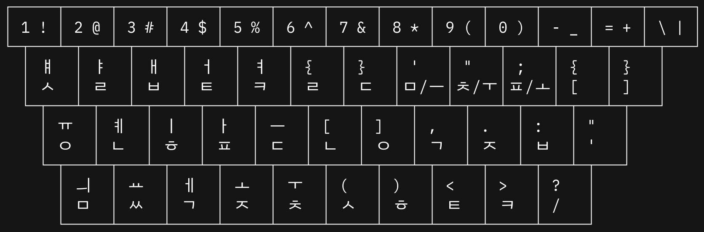

# Patal Input Method

팥알님의 한글 배열을 지원하는 입력기

- ~가벼운 모아치기를 지원합니다.~ 잘못된 구현입니다. 모아치기는 `글쇠를 눌렀다가 모두 떼었을 때에 문자가 들어가야 합니다.`
- 조합이 불가능한 문자에 대해 채움 문자`�`를 명시적으로 출력합니다.

## 세벌식 자판

공병우님이 만든 세벌식 자판이 가장 널리 사용되고 있습니다. [간략한 소개](https://세벌식.kr)

세벌식 자판이 많이 사용되지는 않습니다만 두벌식 자판(KS X 5002)과 함께 윈도우즈 운영체제와 맥OS에서 공식 지원되고 있습니다.

- 초성은 오른손, 중성과 종성은 왼손
- 자주 사용되는 글자를 중심으로 자판을 배열
- 영문에는 드보락[dvorak](https://en.wikipedia.org/wiki/Dvorak_keyboard_layout)이라는 자판이 인체공학적 배열을 목표로 고안되어 사용되고 있음

### 신세벌식 자판

신광식님이 만든 첫/가/끝(첫소리 가운뎃소리 끝소리) 갈마들이 세벌식 자판

- 조합 상태에 따라 중성과 종성을 선택하는 오토마타
- 키보드 상단에 배열된 숫자/특수문자 키에 한글 자소가 할당되지 않음

### 자판의 글자 수

- 두벌식: 26개; 표현 가능한 낱자의 수 33개
- 세벌식: 39개; 표현 가능한 낱자의 수 52~58개
- 신세벌식: 29개; 표현 가능한 낱자의 수 46개

### 추천 자판

팥알님의 추천 자판은 다음과 같습니다.

- 신세벌식인 경우 `P2` 자판: 숫자열을 사용하지 않는 첫/가/끝 갈마들이 [자판](https://pat.im/1136) 배열입니다.
    - 신세벌 P2: 2016~2018년에 공개/개선된 P2 자판
- 세벌식인 경우 `3-P` 자판: 공세벌식에 익숙한 사용자들에게 [추천](https://pat.im/1128)합니다.
    - 공세벌 3-P: 2015년 제안된 공세벌 자판 (P2/P3: 2줄/3줄 숫자 배열 옵션)
    - 공세벌 2012: 390자판의 개선안
    - 공세벌 2011: 391자판의 개선안

## 지원하는 자판

입력기의 이름이 팥알입력기인 만큼 팥알님의 주요 자판을 지원합니다.

- [x] 공세벌식 (숫자 배열): [문서 링크](https://pat.im/1128) [배열 이미지 링크1](https://pat.im/attach/1/9648972827.png) [배열 이미지 링크2](https://pat.im/attach/1/8451389149.png)
- [x] 신세벌식: [문서 링크](https://pat.im/1136) [배열 이미지 링크](https://pat.im/attach/1/6039194145.png)
- [x] 신세벌식 P2커스텀: `ㅋ`,`ㅌ` 의 위치가 `>`,`<` 로 이동된 자판입니다. `50%` 이하 배열 키보드를 고려하였고, 입력기 개발자 개인 취향의 배열이 적용되어 있습니다.

### 커스텀 배열표

숫자키가 없거나 우측 일부 키가 없는 특정 키보드를 고려하여 구성되었습니다.

아스키 아트

<pre>
┌─────┬─────┬─────┬─────┬─────┬─────┬─────┬─────┬─────┬─────┬─────┬─────┬─────┐
│ 1 ! │ 2 @ │ 3 # │ 4 $ │ 5 % │ 6 ^ │ 7 & │ 8 * │ 9 ( │ 0 ) │ - _ │ = + │ \ | │
└─┬───┴─┬───┴─┬───┴─┬───┴─┬───┴─┬───┴─┬───┴─┬───┴─┬───┴─┬───┴─┬───┴─┬───┴─┬───┘
  │ ￅ   │ ￄ   │ ￃ   │ ￆ   │ ￊ   │ {   │ }   │ '   │ "   │ ;   │ {   │ }   │
  │ ﾵ   │ ﾩ   │ ﾲ   │ ﾼ   │ ﾻ   │ ﾩ   │ ﾧ   │ﾱ /ￚ │ﾺ /ￓ │ﾽ /ￌ │ [   │ ]   │
  └─┬───┴─┬───┴─┬───┴─┬───┴─┬───┴─┬───┴─┬───┴─┬───┴─┬───┴─┬───┴─┬───┴─┬───┘
    │ ￗ   │ ￋ   │ ￜ   │ ￂ   │ ￚ   │ [   │ ]   │ ,   │ .   │ :   │ "   │
    │ ﾷ   │ ﾤ   │ ﾾ   │ ﾽ   │ ﾧ   │ ﾤ   │ ﾷ   │ ﾡ   │ ﾸ   │ ﾲ   │ '   │
    └─┬───┴─┬───┴─┬───┴─┬───┴─┬───┴─┬───┴─┬───┴─┬───┴─┬───┴─┬───┴─┬───┘
      │ ￛ   │ ￒ   │ ￇ   │ ￌ   │ ￓ   │ (/← │ )/→ │ <   │ >   │ ?   │
      │ ﾱ   │ ﾶ   │ ﾡ   │ ﾸ   │ ﾺ   │ ﾵ   │ ﾾ   │ ﾼ   │ ﾻ   │ /   │
      └─────┴─────┴─────┴─────┴─────┴─────┴─────┴─────┴─────┴─────┘
</pre>

## 참고

다음과 같은 프로젝트와 문서를 참고하였습니다.

- [구름 입력기](https://github.com/gureum/gureum)
- [나빌 입력기](https://github.com/navilera/NavilIMEforMac)
- [속 입력기](https://github.com/kiding/SokIM)
- [azooKey 입력기](https://github.com/ensan-hcl/azooKey-Desktop)
- [macSKK 입력기](https://github.com/mtgto/macSKK)
- [글걸이](https://pat.im/category/한글%20자판)
- [한글과 유니코드](https://gist.github.com/soomtong/b51861a440e0bfdc58008deb8078d465)
